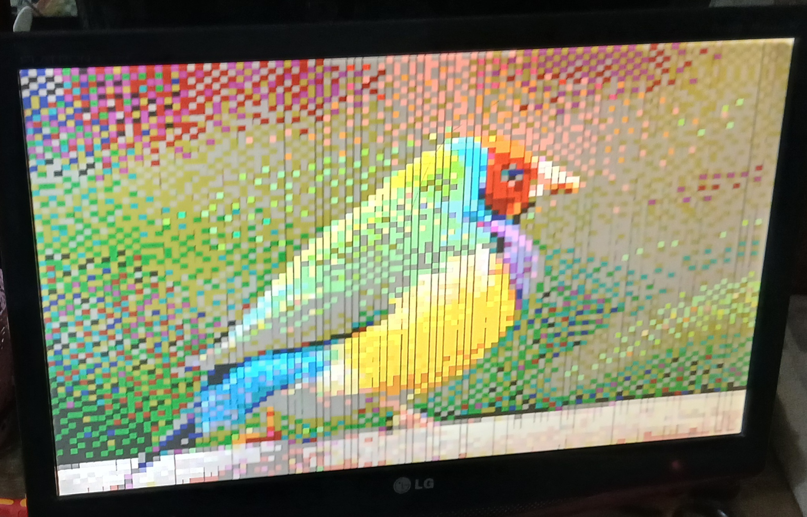

# 🖥️ Breadboard VGA Video Card

> *Pushing pixels with nothing but logic chips, wire, and stubbornness.*

---

## 📺 What Is This?

A fully discrete, breadboard-built VGA video card capable of driving a real monitor — built from scratch using only 74-series logic ICs, EEPROMs, and passive components. No FPGA. No microcontroller doing the heavy lifting. Just raw hardware logic generating real VGA signals at 800×600 resolution.

Inspired by [Ben Eater's video card project](https://eater.net/vga), but built independently with my own debugging, modifications, and hard-won lessons along the way.

---

## 🖼️ Gallery

> *Build photos coming soon*

| | |
|---|---|
| 📷 **Breadboard Overview** |  |
| 📺 **Image Output on Monitor** |  |
| 🔬 **Close-up of Logic ICs** | *(photo)* |
| 📊 **Oscilloscope — HSync/VSync Signals** | *(photo)* |

---

## ⚙️ How It Works

### VGA Signal Generation
VGA works by scanning pixels line by line, left to right, top to bottom. The card generates:

- **HSync** — Horizontal sync pulse, telling the monitor when a new line starts
- **VSync** — Vertical sync pulse, telling the monitor when a new frame starts
- **RGB signals** — 3-bit color (2 bit per channel = 64 colors) during the active display period

### Pixel Clock & Counters
A crystal oscillator drives the pixel clock. Binary counters (74HC161) count pixels horizontally and lines vertically. Comparator logic detects blanking intervals and generates sync pulses at the correct timing.

### Image Storage — EEPROM
Image data is stored in a 28C256 EEPROM. The horizontal and vertical counter outputs form the EEPROM address bus. As counters increment, the EEPROM streams out pixel color data in real time.

### Color Output
3-bit RGB output (R, G, B) through resistor DAC to the VGA connector — 64 colors total.

---

## 🧰 Components Used

| Component | Purpose |
|-----------|---------|
| 74HC161 | 4-bit binary counters with carry (pixel/line counting) |
| 74HC00 74HC30 | NAND gates for sync logic |
| 28C256 EEPROM | Image data storage |
| Pierce Crystal Oscillator 10 MHz | Pixel clock generation |
| Resistors | RGB DAC + pull-ups |
| VGA Connector | Monitor interface |
| Breadboards | The entire PCB 😅 |

---

## 📐 Timing Specs (800×600 @ 60Hz)

| Parameter | Value |
|-----------|-------|
| Pixel Clock | 10 MHz |
| Horizontal Total | 800 pixels |
| Active Lines | 600 |
| ACtual Image | 100 * 75 |

---

## 🔮 Upcoming Upgrade — Animated GIF Support

The current build displays a two frame GIF using a 555 timer to swithc between lower and upper half of 28c256. Sadly could not record it before my monitroe broke due to other reason. I am planning to use 29c040 flash ROM to store upto 32 frames or produce better quality image
Simple. Elegant. Pure hardware.

---

## 🛠️ My Other Projects

### 🖥️ [8-Bit SAP-1 Breadboard Computer](https://github.com/mUmarSaga/8-BIT-BREADBOARDCOMPUTER)
A fully functional 8-bit computer built on breadboards from scratch. Based on Ben Eater's SAP-1 design. Turing complete, runs real programs, built entirely from 74-series logic ICs.

### 💾 [6502 Breadboard Computer — "BEN"](https://github.com/mUmarSaga/6502-COMPUTER)
A MOS 6502-based breadboard computer with UART serial output and speaker. Successfully runs Microsoft BASIC. Named BEN. Has survived more debugging sessions than I can count.

### 🎮 *(More projects coming soon)*

---

## 📚 Resources & References

- [Ben Eater's VGA Video Card Series](https://eater.net/vga) — The original inspiration
- [VGA Signal Timing Specs](http://tinyvga.com/vga-timing) — Critical timing reference
- [28C256 EEPROM Datasheet](https://ww1.microchip.com/downloads/en/DeviceDoc/doc0006.pdf)
- [74HC163 Counter Datasheet](https://www.ti.com/lit/ds/symlink/sn74hc163.pdf)

---

## 👤 Made By

**Umar** — [@mUmarSaga](https://github.com/mUmarSaga)

*First-year CS student at UET Lahore who builds computers for fun.*  
*SAP-1 → 6502 → VGA card → whatever's next.*

---

> *"The most educational thing you can do is build the thing you're trying to understand."*
